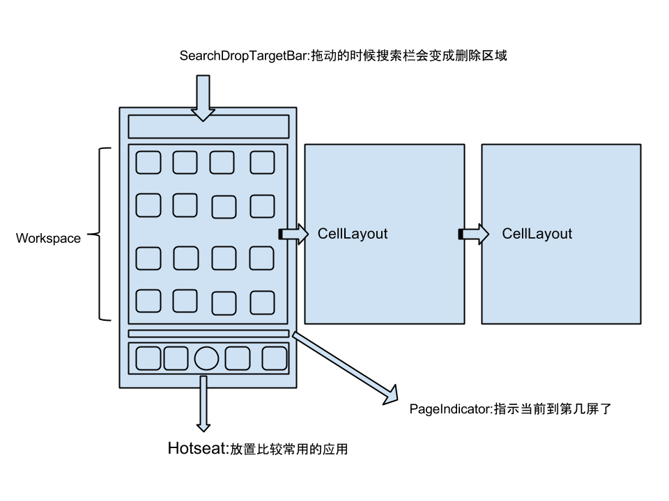

Launcher3
=========

更改官方的Launcher3使得可以在Android Studio编译

* [原始地址](https://android.googlesource.com/platform/packages/apps/Launcher3/)，从729ad90提交开始
* 最小sdk版本为16
* Android 5.0 版本及以上可能会出现因为相同权限声明而不能安装的问题
* 如果你想要可以在Eclipse编译的版本，可以看这个tag: GOODBYE_ECLIPSE

# Launcher3界面的布局和结构

 

# Launcher3中的常用类

- LauncherModel
- BubbleTextView
- DragController
- LauncherAppState
- DragView
- DragSource
- Folder
- FolderIcon
- LauncherProvider
- ItemInfo

原作者说的LauncherProvider的SQLite数据库中有两张表分别是favorites和workspacescreens

- favorites
favorites表

| \_id  | title | intent | container | screen | cellX | cellY | spanX | spanY | itemType | appWidgetId |
| ----- | ----- | ------ | --------- | ------ | ----- | ----- | ----- | ----- | -------- | ----------- |
|    4  | Gallery | intent1 | -100 | 0 | 0 | 0 | {null} | {null} | 0 | -1 |
|   6   | Settings |intent2 | -100 | 0 | 1 | 0 | {null} | {null} |	0 |	-1 | 
|...    |... |...  |...     |...   |...|...|...|...     | ...    |...|

favorites续表

| isShortcut | iconType | iconPackage | icon | uri | displayMode | appWidgetProvider | modified  | restored | profiledId |
| ---------- | -------- | ----------- | ---- |---- | ----------- | ----------------- | --------- | -------- | ---------- |
| {null} | 0 | {null} | {null} | {null} | {null} | 0 | {null} | 0 | 0 | 0 |
| {null} | 0 | {null} | {null} | {null} | {null} | 0 | {null} | 0 | 0 |	0 |
|...    |... |...  |...     |...   |...|...|...|...     | ...    |...|

intent1 = \#Intent;action=android.intent.action.MAIN;category=android.intent.category.LAUNCHER;launchFlags=0x10200000;component=com.android.gallery3d/.app.Gallery;end	
intent2 = \#Intent;action=android.intent.action.MAIN;category=android.intent.category.LAUNCHER;launchFlags=0x10200000;component=com.android.settings/.Settings;end

- workspacescreens

| \_id | screenRank | modified |
|-----|------------|----------|
|0|0|0|

---
我写了几篇博客来讲解Launcher3桌面什么的，有兴趣的可以看看这里：

* [概述](http://www.fookwood.com/archives/788)
* [Android的触摸控制流程](http://www.fookwood.com/archives/806)
* [Launcher3界面的布局和结构](http://www.fookwood.com/archives/846)
* [Launcher3中的常用类](http://www.fookwood.com/archives/854)
* [Launcher3的启动流程（一）](http://www.fookwood.com/archives/863)
* [细说ItemInfo](http://www.fookwood.com/archives/875)
* [Launcher3的启动流程（二）](http://www.fookwood.com/archives/894)
* [Launcher3分析之拖动图标的流程——按下](http://www.fookwood.com/archives/925)
* [Launcher3分析之拖动图标的流程——移动](http://www.fookwood.com/archives/940)
* [Launcher3分析之拖动图标的流程——放下](http://www.fookwood.com/archives/946)
* [PagedView的原理 – 滑动](http://www.fookwood.com/archives/955)
* [如何给Launcher3添加左屏](http://www.fookwood.com/archives/1048)
* [IconCache原理](http://www.fookwood.com/archives/1072)
* [找个Launcher开发](http://www.fookwood.com/archives/1066)
* [LauncherRootView和DragLayer的布局过程](http://www.fookwood.com/archives/1085)

